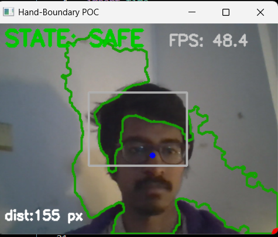

# Hand–Boundary Interaction Prototype (POC)

Real-time hand tracking using classical computer-vision techniques.  
No MediaPipe, no OpenPose, no cloud APIs.

---

## 📸 Demo Screenshots

> Paste your screenshots below:




---

## 🚀 Overview

This prototype tracks the user’s hand through a webcam feed and detects its proximity to a virtual on-screen boundary.  
The system outputs three interaction states:

- **SAFE** – hand far from boundary  
- **WARNING** – hand approaching boundary  
- **DANGER** – hand touching or intersecting boundary (shows **DANGER DANGER**)  

All tracking is implemented with classical CV (color segmentation, contours, centroid/fingertip detection).

---

## ⭐ Features

- Real-time hand detection (8–25 FPS, CPU-only)
- Skin-color segmentation (YCrCb + HSV)
- Fingertip/hand-tip estimation using contour geometry
- Virtual rectangle boundary rendered on frame
- Distance-based state logic: SAFE → WARNING → DANGER
- On-screen overlay for state + red flashing **DANGER DANGER**
- Uses only OpenCV + NumPy

---

## 📦 Installation

```bash
pip install opencv-python numpy
